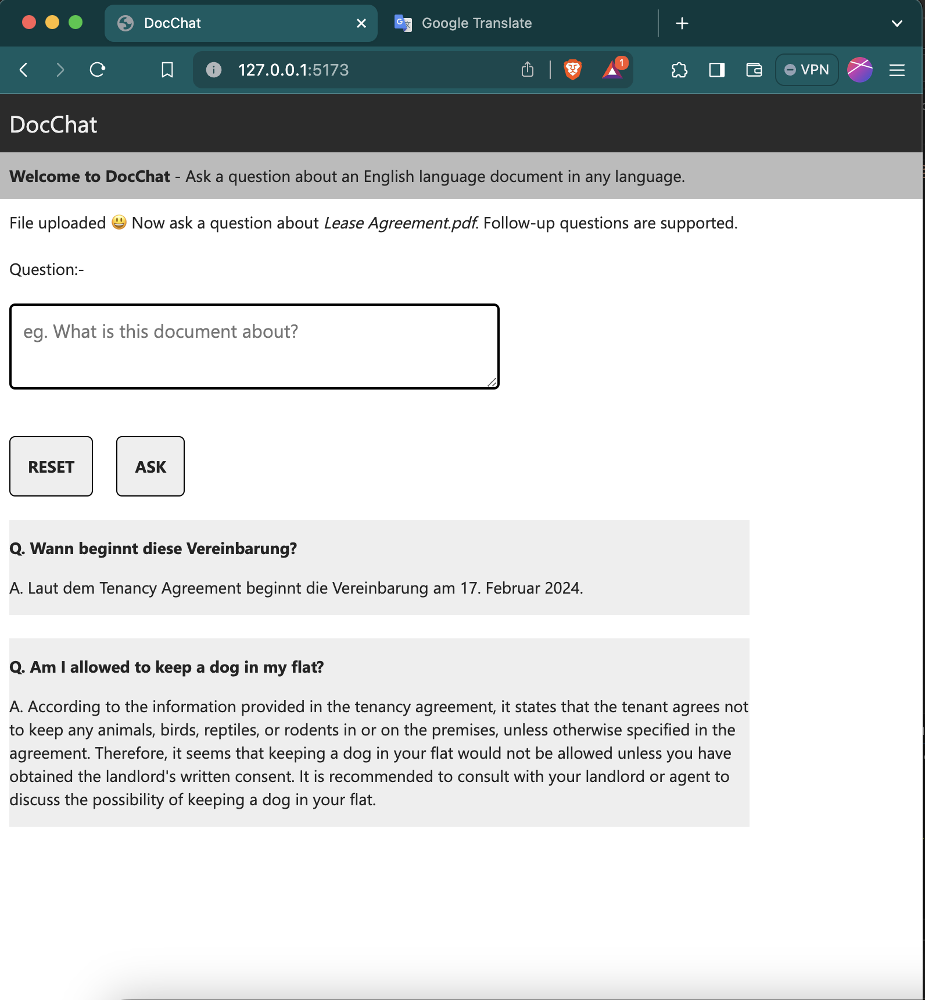
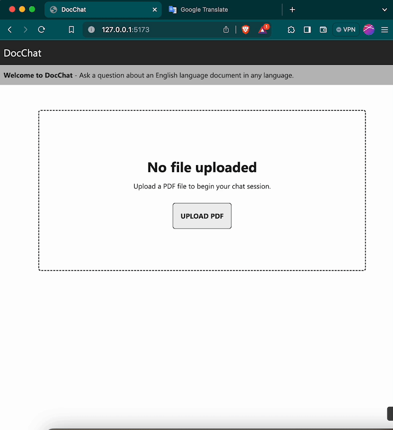

# DocChat (formally ChatApp)





## About

This repo contains a React front-end application, and a Node back-end application.

A user can upload a PDF file (in English) and then ask a questions about the document in any language.

* The file is stored (and retrieved) in Azure AI Search
  * Embeddings are additionally stored and form part of the hybrid search for RAG content retrievel
* Azure OpenAI (gpt-35-turbo-16k and text-embedding-ada-002) is used
  * To translate any question into English for search
  * To generate embeddings
  * To deduce answers based on search results

## AI Search index

An Azure AI Index is required. Free tier is fine for testing.

An AI Search index should be set up with the following schema:-

```
{
    "name" : "chat-comp-index",
    "fields": [
        { "name": "Id", "type": "Edm.String", "key": true, "searchable": true },
        { "name": "SessionId", "type": "Edm.String", "key": false, "searchable": true, "filterable": true },
        { "name": "ChunkId", "type": "Edm.String", "key": false, "searchable": true, "filterable": true },
        { "name": "FileName", "type": "Edm.String", "key": false, "searchable": true, "filterable": false, "sortable": false, "facetable": false },
         { "name": "FileSize", "type": "Edm.Int32", "key": false, "searchable": false, "filterable": false, "sortable": false, "facetable": false },
        { "name": "Text", "type": "Edm.String", "key": false, "searchable": true, "filterable": false },
        {
            "name": "Embedding",
            "type": "Collection(Edm.Single)",
            "searchable": true,
            "retrievable": true,
            "dimensions": 1536,
            "vectorSearchConfiguration": "vectorConfig"
        }
    ],
        "vectorSearch": {
        "algorithmConfigurations": [
            {
                "name": "vectorConfig",
                "kind": "hnsw",
                "hnswParameters": {
                    "m": 4,
                    "efConstruction": 400,
                    "efSearch": 500,
                    "metric": "cosine"
                }
            }
        ]
    }
}
```

## To compile

* In `./Backend`, add a `.nodemon` file containing the following

```
{
    "env": {
        "SEARCH_API_ENDPOINT": "https://[instance].search.windows.net",
        "SEARCH_API_KEY": "[api-key]",
        "SEARCH_INDEX_NAME": "[index-name]",
        "AZURE_OPENAI_ENDPOINT": "https://[instance-name].azure.com/",
        "AZURE_OPENAI_API_KEY": "[api-key]",
        "AZURE_OPENAI_MODEL_EMBEDDINGS": "text-embedding-ada-002",
        "AZURE_OPENAI_MODEL_CHAT": "gpt-35-turbo-16k"
    }
}
```

* In `./Frontend`, add a `.env.development` file containing the following

```
VITE_APP_NAME=DocChat
VITE_API_BASE_URL=http://127.0.0.1:3000
```

* From each directory (`./Backend` and `./Frontend`), run the following commands to compile and run
  * `pnpm install`
  * `pnpm run dev`


## Thoughts for improvement

* The app contains no authentication mechanism, this should be changed if being moved into production
* The app does not retain chat sessions between browser refreshes, this should be changed by storing chat conversation in a database (or by using a browser with IndexedDB)
